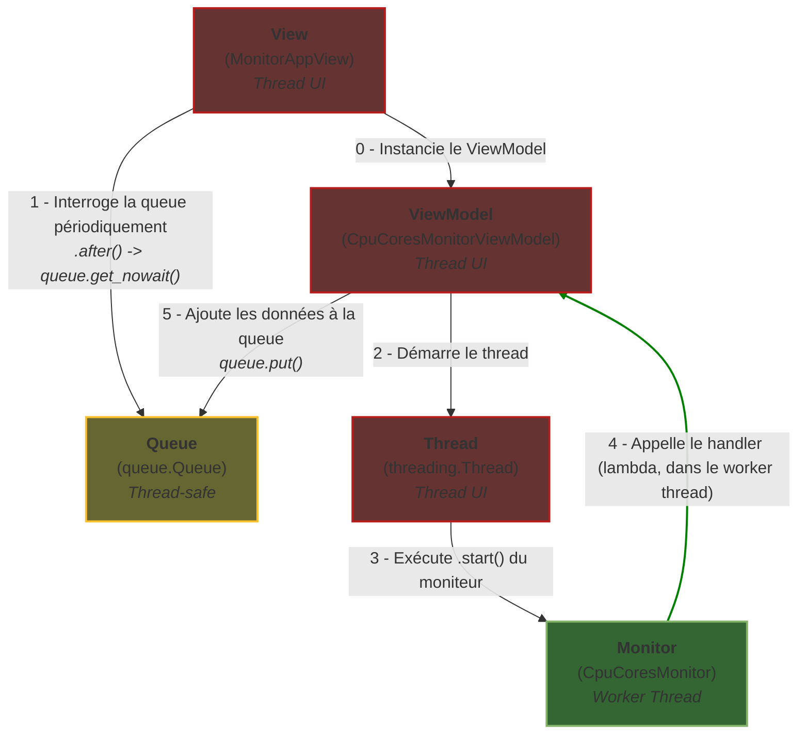
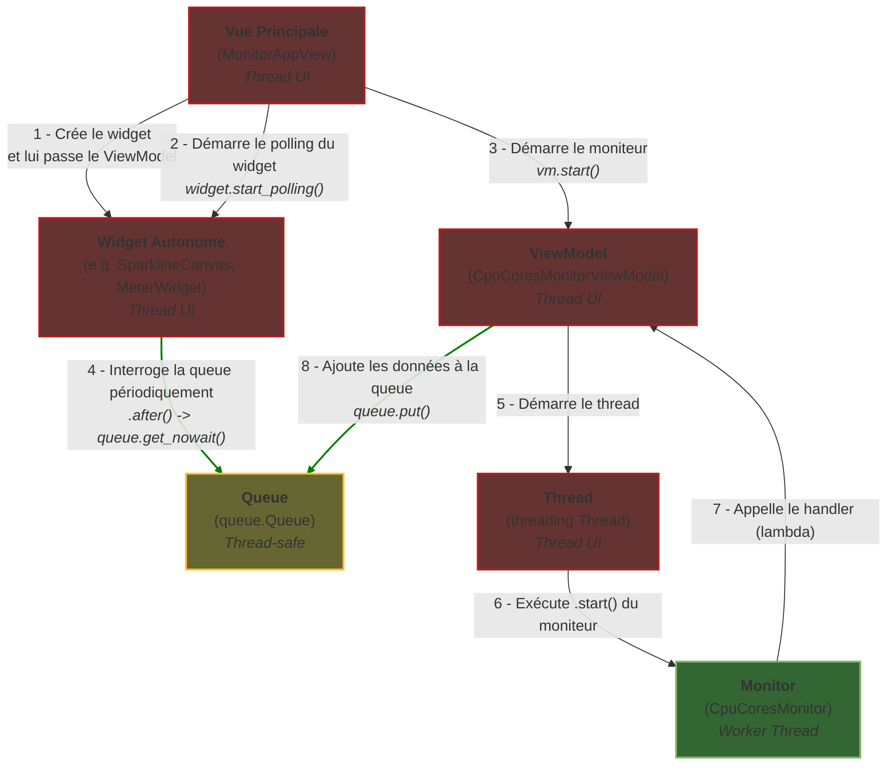

# UML des script

## Architecture PySide6 (monitor-mini-pyside6.py)

```mermaid
graph TD
    P_View["<b>View</b><br>(e.g. CompactCpuSparklineView)<br><i>Thread UI</i>"]
    P_VM["<b>ViewModel</b><br>(CpuCoresMonitorViewModel)<br><i>Thread UI</i>"]
    P_Thread["<b>Thread</b><br>(CpuCoresMonitorThread)<br><i>Thread UI</i>"]
    P_Monitor["<b>Monitor</b><br>(CpuCoresMonitor)<br><i>Worker Thread</i>"]

    P_View -- "Connecte son slot au signal<br><i>.signals.updated.connect(on_updated)</i>" --> P_VM
    P_VM -- "Démarre le thread" --> P_Thread
    P_Thread -- "Exécute .start() du moniteur" --> P_Monitor
    P_Monitor -- "Appelle le handler (dans le worker thread)" --> P_Thread
    P_Thread -- "Émet un signal Qt<br><i>signals.updated.emit()</i>" --> P_VM

    %% --- Styles ---
    style P_View fill:#336,stroke:#6c8ebf,stroke-width:2px
    style P_VM fill:#336,stroke:#6c8ebf,stroke-width:2px
    style P_Thread fill:#336,stroke:#6c8ebf,stroke-width:2px
    style P_Monitor fill:#363,stroke:#82b366,stroke-width:2px

    linkStyle 4 stroke-width:2px,fill:none,stroke:green;

```

## Architecture Tkinter (monitor-mini-tkinter.py)

```mermaid
graph TD

    T_View["<b>View</b><br>(MonitorAppView)<br><i>Thread UI</i>"]
    T_VM["<b>ViewModel</b><br>(CpuCoresMonitorViewModel)<br><i>Thread UI</i>"]
    T_Queue["<b>Queue</b><br>(queue.Queue)<br><i>Thread-safe</i>"]
    T_Thread["<b>Thread</b><br>(threading.Thread)<br><i>Thread UI</i>"]
    T_Monitor["<b>Monitor</b><br>(CpuCoresMonitor)<br><i>Worker Thread</i>"]

    T_View -- "0 - Instancie le ViewModel" --> T_VM
    T_View -- "1 - Interroge la queue périodiquement<br><i>.after() -> queue.get_nowait()</i>" --> T_Queue
    T_VM -- "2 - Démarre le thread" --> T_Thread
    T_Thread -- "3 - Exécute .start() du moniteur" --> T_Monitor
    T_Monitor -- "4 - Appelle le handler (lambda, dans le worker thread)" --> T_VM
    T_VM -- "5 - Ajoute les données à la queue<br><i>queue.put()</i>" --> T_Queue

    %% --- Styles ---
    style T_View fill:#633,stroke:#b71c1c,stroke-width:2px,padding:3px
    style T_VM fill:#633,stroke:#b71c1c,stroke-width:2px
    style T_Queue fill:#663,stroke:#fbc02d,stroke-width:2px
    style T_Thread fill:#633,stroke:#b71c1c,stroke-width:2px
    style T_Monitor fill:#363,stroke:#82b366,stroke-width:2px

    linkStyle 4 stroke-width:2px,fill:none,stroke:green;
```

## Architecture Tkinter (Refactorisée)

```mermaid
graph TD

    T_MainView["<b>Vue Principale</b><br>(MonitorAppView)<br><i>Thread UI</i>"]
    T_Widget["<b>Widget Autonome</b><br>(e.g. SparklineCanvas, MeterWidget)<br><i>Thread UI</i>"]
    T_VM["<b>ViewModel</b><br>(CpuCoresMonitorViewModel)<br><i>Thread UI</i>"]
    T_Queue["<b>Queue</b><br>(queue.Queue)<br><i>Thread-safe</i>"]
    T_Thread["<b>Thread</b><br>(threading.Thread)<br><i>Thread UI</i>"]
    T_Monitor["<b>Monitor</b><br>(CpuCoresMonitor)<br><i>Worker Thread</i>"]

    T_MainView -- "1 - Crée le widget<br>et lui passe le ViewModel" --> T_Widget
    T_MainView -- "2 - Démarre le polling du widget<br><i>widget.start_polling()</i>" --> T_Widget
    T_MainView -- "3 - Démarre le moniteur<br><i>vm.start()</i>" --> T_VM

    T_Widget -- "4 - Interroge la queue périodiquement<br><i>.after() -> queue.get_nowait()</i>" --> T_Queue

    T_VM -- "5 - Démarre le thread" --> T_Thread
    T_Thread -- "6 - Exécute .start() du moniteur" --> T_Monitor
    T_Monitor -- "7 - Appelle le handler (lambda)" --> T_VM
    T_VM -- "8 - Ajoute les données à la queue<br><i>queue.put()</i>" --> T_Queue

    %% --- Styles ---
    style T_MainView fill:#633,stroke:#b71c1c,stroke-width:2px
    style T_Widget fill:#633,stroke:#b71c1c,stroke-width:2px
    style T_VM fill:#633,stroke:#b71c1c,stroke-width:2px
    style T_Queue fill:#663,stroke:#fbc02d,stroke-width:2px
    style T_Thread fill:#633,stroke:#b71c1c,stroke-width:2px
    style T_Monitor fill:#363,stroke:#82b366,stroke-width:2px

    linkStyle 3 stroke-width:2px,fill:none,stroke:green;
    linkStyle 7 stroke-width:2px,fill:none,stroke:green;
```